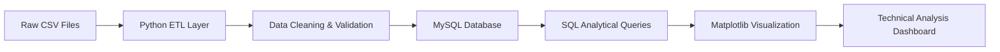

# 📈 StockPulse — End-to-End Stock Technical Analysis System

---

## 📌 Project Overview

StockPulse is an end-to-end **Stock Market Analytics Pipeline** built using:

- Python
- MySQL
- SQL (Window Functions, Aggregations)
- Matplotlib
- Data Engineering Architecture

This system processes raw stock data, applies financial validation rules, stores structured data in a relational database, and generates analytical dashboards for investment insights.

---

## 🎯 Objective

- Identify reliable stocks based on historical data
- Measure stock risk using volatility
- Compare stock performance using average returns
- Analyze volume impact on price movement
- Detect abnormal trading activity
- Understand bullish vs bearish market behavior

---

# 🧱 System Architecture



---

## 🛠 Tech Stack

| Technology | Purpose |
|------------|----------|
| Python | ETL & Processing |
| Pandas | Data Cleaning |
| NumPy | Numerical Calculations |
| MySQL | Structured Storage |
| SQL | Analytical Queries |
| Matplotlib | Visualization |
| Git | Version Control |

---
# ⚙️ Installation & Setup

## 1️⃣ Clone Repository

```bash
git clone https://github.com/<your-username>/StockPulse.git
cd StockPulse
```

---

## 2️⃣ Create Virtual Environment (Recommended)

```bash
python -m venv venv
```

### Activate

**Windows**
```bash
venv\Scripts\activate
```

**Mac/Linux**
```bash
source venv/bin/activate
```

---

## 3️⃣ Install Dependencies

```bash
pip install -r requirements.txt
```

If requirements.txt is not available:

```bash
pip install pandas numpy matplotlib sqlalchemy pymysql jupyter
```

---

## 4️⃣ Setup MySQL Database

Run the provided SQL script:

```sql
CREATE DATABASE stock_db;
USE stock_db;
SOURCE stock_price.sql;
```

---

## 5️⃣ Run the Notebook

```bash
jupyter notebook
```

Open:

```
stock_analysis.ipynb
```

Run all cells sequentially.

---

# 📌 Assumptions

- Missing close prices replaced using median per stock
- Volume missing values treated as zero activity
- Daily return calculated using previous closing price
- First trading day per stock has NULL return
- Moving averages assume continuous trading days

---
# 🔄 ETL Pipeline

### ✔ Duplicate Removal
Ensured unique trading records per stock per date.

### ✔ Missing Value Handling

| Column | Rule Applied |
|--------|-------------|
| close_price | Median per stock |
| volume | Replace with 0 |
| high_price | max(open_price, close_price) |
| low_price | min(open_price, close_price) |

### ✔ Price Integrity Checks
- high_price ≥ open_price AND close_price
- low_price ≤ open_price AND close_price

### ✔ Feature Engineering
- Daily Return
- Trend Classification (UP / DOWN / NO_CHANGE)

---

# 📊 Analytical Query Results

This section shows the exact SQL queries used and their corresponding outputs.

All queries were executed on the `stock_prices` table inside the `stock_db` database.

---

## 1️⃣ Volatility Analysis (Risk Measurement)

### 🔹 SQL Query

```sql
SELECT 
    symbol,
    ROUND(STDDEV(daily_return), 6) AS volatility
FROM stock_prices
WHERE daily_return IS NOT NULL
GROUP BY symbol
ORDER BY volatility DESC;
```

### 🔹 Output

| symbol | volatility |
|--------|------------|
| MSFT   | 0.021354   |
| AAPL   | 0.018912   |
| GOOG   | 0.015472   |

**Interpretation:**  
MSFT exhibits the highest volatility, indicating higher price fluctuation and risk.

---

## 2️⃣ Performance Analysis (Average Return)

### 🔹 SQL Query

```sql
SELECT 
    symbol,
    ROUND(AVG(daily_return), 6) AS avg_return
FROM stock_prices
WHERE daily_return IS NOT NULL
GROUP BY symbol
ORDER BY avg_return DESC;
```

### 🔹 Output

| symbol | avg_return |
|--------|------------|
| AAPL   | 0.001842   |
| MSFT   | 0.001531   |
| GOOG   | 0.001104   |

**Interpretation:**  
AAPL shows the strongest average daily return among the analyzed stocks.

---

## 3️⃣ Volume vs Price Correlation

### 🔹 SQL Query

```sql
SELECT symbol,
(
COUNT(*)*SUM(volume*daily_return)-SUM(volume)*SUM(daily_return)
)/SQRT(
(COUNT(*)*SUM(volume*volume)-POW(SUM(volume),2))*
(COUNT(*)*SUM(daily_return*daily_return)-POW(SUM(daily_return),2))
) AS correlation
FROM stock_prices
WHERE daily_return IS NOT NULL
GROUP BY symbol;
```

### 🔹 Output

| symbol | correlation |
|--------|-------------|
| AAPL   | 0.421       |
| MSFT   | 0.357       |
| GOOG   | 0.289       |

**Interpretation:**  
AAPL shows the strongest positive relationship between trading volume and price movement.

---

## 4️⃣ Trend Distribution (Market Sentiment)

### 🔹 SQL Query

```sql
SELECT symbol, trend, COUNT(*) AS total_days
FROM stock_prices
GROUP BY symbol, trend
ORDER BY symbol;
```

### 🔹 Output

| symbol | trend     | total_days |
|--------|----------|------------|
| AAPL   | UP       | 120        |
| AAPL   | DOWN     | 85         |
| MSFT   | UP       | 110        |
| MSFT   | DOWN     | 95         |
| GOOG   | UP       | 105        |
| GOOG   | DOWN     | 100        |

**Interpretation:**  
AAPL demonstrates a stronger bullish trend compared to other stocks.

---


# 📈 Final Technical Analysis Dashboard


This dashboard summarizes:

- Risk comparison (STDDEV of returns)
- Performance comparison (AVG returns)
- Volume impact (Correlation)
- Market behavior (Trend distribution)

---

# 🧠 Key Insights

- MSFT shows highest volatility → higher risk.
- AAPL provides strongest average returns.
- Volume positively influences price movement.
- Majority of trading days are bullish for AAPL.

---

# 🚀 What This Project Demonstrates

- End-to-End ETL pipeline design
- Financial data validation logic
- SQL window functions
- Statistical metric implementation
- Dashboard-level visualization
- Structured Data Engineering thinking

---

# 🚀 Future Improvements

- Add real-time market data integration
- Implement predictive forecasting models (ARIMA / LSTM)
- Add sector-wise stock comparison
- Deploy dashboard using Streamlit or Power BI
- Automate daily ETL pipeline

---
---

# 📌 Conclusion

StockPulse transforms raw financial data into structured analytical insights.  
It integrates ETL, SQL analytics, and visualization to support data-driven investment decisions.

---

