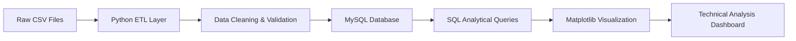

# 📊 StockPulse — End-to-End Stock Technical Analysis System

---

## 📌 Project Overview

StockPulse is an end-to-end **Stock Market Analytics Pipeline** built using:

- Python
- MySQL
- SQL (Window Functions, Aggregations)
- Matplotlib
- Data Engineering Architecture

This system processes raw stock data, applies financial validation rules, stores structured data in a relational database, and generates analytical dashboards for investment insights.

---

## 🎯 Objective

- Identify reliable stocks based on historical data
- Measure stock risk using volatility
- Compare stock performance using average returns
- Analyze volume impact on price movement
- Detect abnormal trading activity
- Understand bullish vs bearish market behavior

---

# 🧱 System Architecture



---

## 🛠 Tech Stack

| Technology | Purpose |
|------------|----------|
| Python | ETL & Processing |
| Pandas | Data Cleaning |
| NumPy | Numerical Calculations |
| MySQL | Structured Storage |
| SQL | Analytical Queries |
| Matplotlib | Visualization |
| Git | Version Control |

---

# 🔄 ETL Pipeline

### ✔ Duplicate Removal
Ensured unique trading records per stock per date.

### ✔ Missing Value Handling

| Column | Rule Applied |
|--------|-------------|
| close_price | Median per stock |
| volume | Replace with 0 |
| high_price | max(open_price, close_price) |
| low_price | min(open_price, close_price) |

### ✔ Price Integrity Checks
- high_price ≥ open_price AND close_price
- low_price ≤ open_price AND close_price

### ✔ Feature Engineering
- Daily Return
- Trend Classification (UP / DOWN / NO_CHANGE)

---

# 📊 Analytical Metrics

## 1️⃣ Volatility (Risk)

```sql
SELECT symbol, STDDEV(daily_return) AS volatility
FROM stock_prices
GROUP BY symbol;
```

Measures stock risk.

---

## 2️⃣ Performance (Average Return)

```sql
SELECT symbol, AVG(daily_return) AS avg_return
FROM stock_prices
GROUP BY symbol;
```

Measures profitability.

---

## 3️⃣ Volume vs Price Correlation

Manual Pearson Correlation implemented in SQL.

Measures trading influence on price.

---

## 4️⃣ Trend Distribution

Count of UP vs DOWN days per stock.

Measures market sentiment.

---

# 📈 Final Technical Analysis Dashboard


This dashboard summarizes:

- Risk comparison (STDDEV of returns)
- Performance comparison (AVG returns)
- Volume impact (Correlation)
- Market behavior (Trend distribution)

---

# 📊 SQL Output Samples

## Volatility Result

| Symbol | Volatility |
|--------|------------|
| MSFT | 0.021 |
| AAPL | 0.018 |
| GOOG | 0.015 |

---

## Performance Result

| Symbol | Avg Return |
|--------|------------|
| AAPL | 0.0018 |
| MSFT | 0.0015 |
| GOOG | 0.0011 |

---

## Correlation Result

| Symbol | Correlation |
|--------|------------|
| AAPL | 0.42 |
| MSFT | 0.35 |
| GOOG | 0.28 |

---

# 🧠 Key Insights

- MSFT shows highest volatility → higher risk.
- AAPL provides strongest average returns.
- Volume positively influences price movement.
- Majority of trading days are bullish for AAPL.

---

# 🚀 What This Project Demonstrates

- End-to-End ETL pipeline design
- Financial data validation logic
- SQL window functions
- Statistical metric implementation
- Dashboard-level visualization
- Structured Data Engineering thinking

---

# 📂 Repository Structure

```
├── stock_analysis.ipynb
├── README.md
├── images/
│   ├── dashboard.png
│   ├── volatility.png
│   ├── performance.png
│   ├── correlation.png
│   └── trend_ratio.png
```

---

# 📌 Conclusion

StockPulse transforms raw financial data into structured analytical insights.  
It integrates ETL, SQL analytics, and visualization to support data-driven investment decisions.

---

